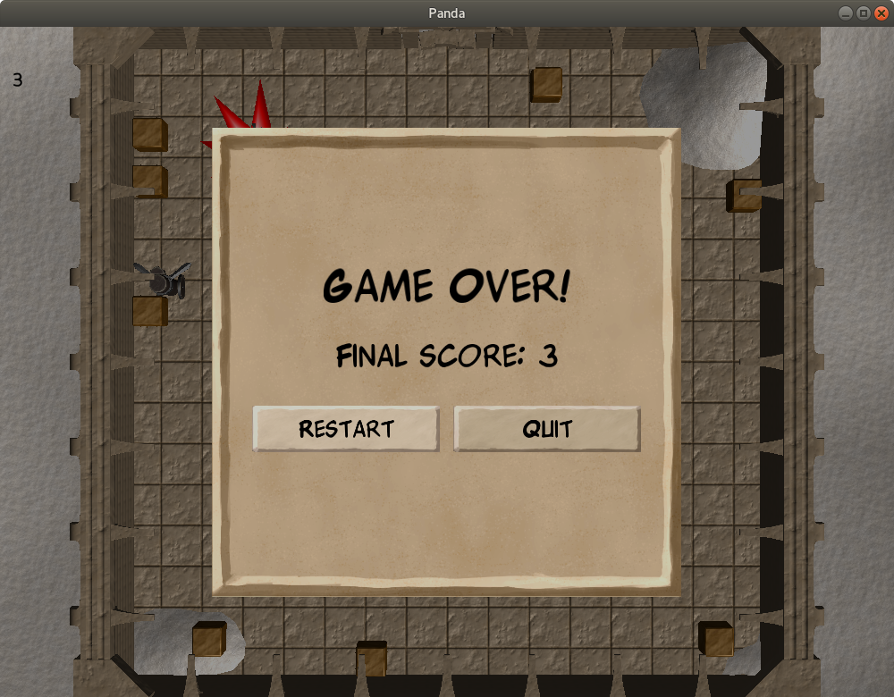
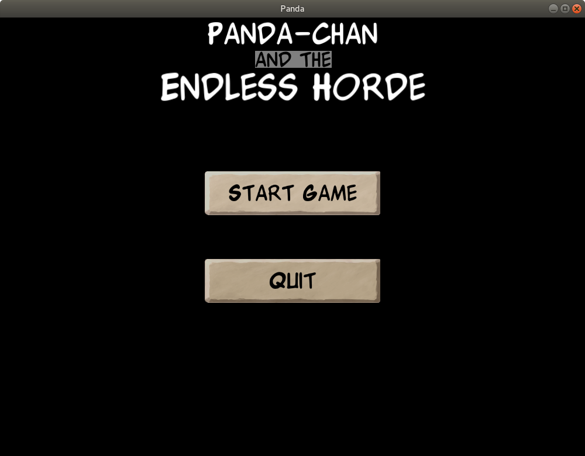

Your Menu, Sir
=
_In which we build menus with DirectGUI, and provide a way to restart after game-over_

The final elements to add to our game are its menus. Specifically, we will be adding two: a "game-over" menu, that allows the player to either restart the level or quit, and a main menu, which is shown before play begins.

To this end, we'll be using Panda3D's built-in GUI toolkit, DirectGUI. It's a bit of a clunky thing, but for many purposes it works. (It is possible to use third-party GUI toolkits with Panda3D, but we won't touch on that here.)

Panda's GUI elements are, like pretty much everything else, nodes in the node-heirarchy. As with any node, GUI elements can be "parented" under (that is, made the children of) other nodes, including other GUI nodes. Indeed, that's how we'll construct our menus from their parts: GUI-controls "contained" within others (such as a button in a menu) will be children of their "containers". By default, GUI elements are parented under a special root-node called "aspect2d".

As to laying out and customising GUI controls, this is generally done via a set of keyword-parameters passed into their constructors. (Although many of these can be changed at a later point, too.)  There are a number of common parameters (like "frameSize"), and each GUI-element class generally has its own, specific parameters.

Almost all of the following code will be done in "Game.py".

To start with, let's import the various DirectGUI elements, ready to use:

```python
# In your "import" statements:
from direct.gui.DirectGui import *
```

That done, let's build our "game-over" menu.

This will be "dialogue box", a special sort of GUI-object that can obscure things behind it, and prevent mouse-clicks or keyboard-input from getting through.

```python
# In the "__init__" method:

# Make a "DirectDialog" object
#
# Parameters used:
# "frameSize" is how big the GUI element is
#
# "fadeScreen" is a semi-transparent cover that
#   DirectDialog can put "behind" itself,
#   to obscure the backdrop and prevent mouse-clicks
#   and key-presses from getting through.
#
# "relief" is the style of its backing geometry, whether
#   with a border that's raised, sunken, flat, or ridged--
#   or with no backing at all.
self.gameOverScreen = DirectDialog(frameSize = (-0.7, 0.7, -0.7, 0.7),
                                   fadeScreen = 0.4,
                                   relief = DGG.FLAT)
# We don't want this screen to show
# up until the player loses, so we'll
# hide it at first.
self.gameOverScreen.hide()
```

To this we'll add a heading that reads "game-over", a label that gives the final score for the run, and buttons that allow the player to restart or quit:

```python
# Create a "label"--a GUI item that shows
# text, an image, or both:
#
# Parameters used:
# "text" is, well, the text to display
#
# "parent" is the node of which this GUI item
#   should be a child. We're attaching it to our
#   "gameOverScreen" in this case.
#
# "pos" is the location at which we 
#   want it to appear. As with all nodes,
#   this is relative to its parent!
label = DirectLabel(text = "Game Over!",
                    parent = self.gameOverScreen,
                    scale = 0.1,
                    pos = (0, 0, 0.2))

# Similarly, but with no text--for now!
self.finalScoreLabel = DirectLabel(text = "",
                                   parent = self.gameOverScreen,
                                   scale = 0.07,
                                   pos = (0, 0, 0))

# Make a button.
#
# Parameters used (that are new):
# "command" is the method to run when
#   the button is pressed
btn = DirectButton(text = "Restart",
                   command = self.startGame,
                   pos = (-0.3, 0, -0.2),
                   parent = self.gameOverScreen,
                   scale = 0.07)


btn = DirectButton(text = "Quit",
                   command = self.quit,
                   pos = (0.3, 0, -0.2),
                   parent = self.gameOverScreen,
                   scale = 0.07)
```

With the basics of the game-over screen done, let's implement the logic to show it when the player loses, and hide it when they start (or more to the point, restart) the game:

```python
# In the "startGame" method:

# If we happen to be restarting the
# game, hide the game-over screen!
self.gameOverScreen.hide()
```

```python
# In the "update" method:

# After the "if self.player.health > 0:" section,
# add an "else" section. That is, something like this:
#
# if self.player.health > 0:
#   ... lots of code here ...
# else:

# If we've run out of health...
else:
    # If the game-over screen isn't showing...
    if self.gameOverScreen.isHidden():
        # Show the game-over screen, and set the
        # text of the "finalScoreLabel" object to
        # reflect the player's score.
        self.gameOverScreen.show()
        self.finalScoreLabel["text"] = "Final score: " + str(self.player.score)
        self.finalScoreLabel.setText()
```

With all of that done, the game-over screen should now be functional! Try running the game and letting the player-character be killed. You should now see the game-over screen pop up, and have the option to either restart or quit.

By default, however, DirectGUI isn't pretty. (Or at least, so I think.) So, let's customise its appearance a bit.

Before we continue, a note for the sake of clarity: much of what we're about to do involves adding new keyword-parameters to the GUI-objects that we created above, rather than making new ones. Indeed, we'll only be adding a few new objects; hopefully it'll be clear which things are new, and which we've already made!

First, we'll replace the default font.

There are a few ways to handle fonts in Panda3D, but one simple way is to just load it via the "loader" object, as with models and sounds:

```python
# In the "__init__" method:
self.font = loader.loadFont("Fonts/Wbxkomik.ttf")
```

We can then use it when constructing our various DirectGUI elements, by including it as an appropriate keyword:

```python
# In the "__init__" method:

# For DirectLabels and DirectButtons,
# the appropriate keyword parameter is "text_font".
# Our labels and buttons thus become the following:
label = DirectLabel(text = "Game Over!",
                    parent = self.gameOverScreen,
                    scale = 0.1,
                    pos = (0, 0, 0.2),
                    text_font = self.font)
# Note the "text_font = self.font" line at the end!

self.finalScoreLabel = DirectLabel(text = "",
                                   parent = self.gameOverScreen,
                                   scale = 0.07,
                                   pos = (0, 0, 0),
                                   text_font = self.font)

btn = DirectButton(text = "Restart",
                   command = self.startGame,
                   pos = (-0.3, 0, -0.2),
                   parent = self.gameOverScreen,
                   scale = 0.07,
                   text_font = self.font)


btn = DirectButton(text = "Quit",
                   command = self.quit,
                   pos = (0.3, 0, -0.2),
                   parent = self.gameOverScreen,
                   scale = 0.07,
                   text_font = self.font)
```

That's better, but the backdrops of our GUI-items are still a flat grey.

To start with, the game-over screen itself. In this case, we'll simply apply a texture to its geometry, via the "frameTexture" keyword:

```python
# In the "__init__" method:

self.gameOverScreen = DirectDialog(frameSize = (-0.7, 0.7, -0.7, 0.7),
                                   fadeScreen = 0.4,
                                   relief = DGG.FLAT,
                                   frameTexture = "UI/stoneFrame.png")
```

Next, we'll do something similar with our DirectButtons.

This is a little more complicated. While we could just apply a single texture and call it done, we'll do something slightly more detailed: we'll provide a custom image for each of the states that our buttons can have. There are four such states, and thus four images: normal, highlighted/rollover, pressed, and disabled. The one catch is that Panda expects them in a specific order:
* Normal
* Pressed
* Rollover
* Disabled.

By default, Panda makes buttons appear to be "raised"; this corresponds to setting the "relief" keyword-parameter to "DGG.RAISED". Since our button-images incorporate that effect in their images, we want to disable this. To do so, we simply pass in the "relief" keyword-parameter ourselves, and set it to "DGG.FLAT". ("DGG" being the "DirectGUI Globals" object.)

Next, we'll make sure that our buttons have a size appopriate to our images. The images are 512x128 pixels each, so we want our buttons to similarly have a 4:1 width:height ratio. This we'll apply by setting the "frameSize" keyword-parameter.

We'll also adjust the position of the text on the buttons a bit, to better fit our images, via the "text_pos" parameter.

As our button-images have transparent corners, we'll apply transparency to our button-objects.

And while we're at it, we'll give our buttons a nice sound-effect to be played when they're pressed, via the "clickSound" keyword-parameter.

Thus we have the following:

```python
# In the "__init__" method:

# A set of images, one for each button-state,
# in the order that Panda expects
buttonImages = (
    loader.loadTexture("UI/UIButton.png"),
    loader.loadTexture("UI/UIButtonPressed.png"),
    loader.loadTexture("UI/UIButtonHighlighted.png"),
    loader.loadTexture("UI/UIButtonDisabled.png")
)

btn = DirectButton(text = "Restart",
                   command = self.startGame,
                   pos = (-0.3, 0, -0.2),
                   parent = self.gameOverScreen,
                   scale = 0.07,
                   text_font = self.font,
                   clickSound = loader.loadSfx("Sounds/UIClick.ogg"),
                   frameTexture = buttonImages,
                   frameSize = (-4, 4, -1, 1),
                   text_scale = 0.75,
                   relief = DGG.FLAT,
                   text_pos = (0, -0.2))
btn.setTransparency(True)

btn = DirectButton(text = "Quit",
                   command = self.quit,
                   pos = (0.3, 0, -0.2),
                   parent = self.gameOverScreen,
                   scale = 0.07,
                   text_font = self.font,
                   clickSound = loader.loadSfx("Sounds/UIClick.ogg"),
                   frameTexture = buttonImages,
                   frameSize = (-4, 4, -1, 1),
                   text_scale = 0.75,
                   relief = DGG.FLAT,
                   text_pos = (0, -0.2))
btn.setTransparency(True)
```

One more thing: if we try our game now, we'll see all of our image-backdrops--but the labels will still be surrounded by their standard grey backdrops! To remove these, we'll simply set their "relief" keyword-parameters to "None", resulting in the following code:

```python
label = DirectLabel(text = "Game Over!",
                    parent = self.gameOverScreen,
                    scale = 0.1,
                    pos = (0, 0, 0.2),
                    text_font = self.font,
                    relief = None)

self.finalScoreLabel = DirectLabel(text = "",
                                   parent = self.gameOverScreen,
                                   scale = 0.07,
                                   pos = (0, 0, 0),
                                   text_font = self.font,
                                   relief = None)
```

Thus the final result looks like this:



Next, we'll build a simple main menu. It will have:
* A title (using three DirectLabels, for easy variation of colour, backing, and size)
* A "start game" button
* And a "quit" button.

The "start game" button will simply call the "startGame" method, and the "quit" button will call the "quit" method.

A more serious project might additionally have an options menu, where the player could set the sound- and music- volume, adjust the controls, and so on, and perhaps other menus too. But for tutorial purposes, this will do.

Building our main menu will use pretty much the same elements as the game-over screen, but instead of a DirectDialog, we'll use a simple DirectFrame--one of the basic DirectGUI classes, from which most others derive.

We will be using one trick: our title menu will have a black backdrop, and we'll make that backdrop cover the entire screen.

You may recall that DirectGUI elements are by default parented to "aspect2d"; "aspect2d" is itself a child of another node, called "render2d". In short, "render2d" is set up such that its coordinates, from window-edge to window-edge, always run from -1 to 1 on both axes. That is, on the x-axis, the left-hand side of the window has an x-coordinate of -1, and the right-hand side of the window has an x-coordinate of 1, and similarly for the y-axis--regardless of the size of the window. 

The "aspect2d" node is then scaled such that the range from -1 to 1 on both axes makes a square, regardless of the size of the screen.

This means that things parented to "aspect2d" have the correct aspect-ratio, while things parented to "render2d" may be stretched. But on the other hand, things parented to "render2d" always cover the same amount of the window, regardless of the window's size and aspect ratio.

So, if we make a GUI object that's parented to "render2d", and that runs from -1 to 1 on both axes, it should cover the entire window, even if we resize that window.

And since our backdrop is nothing but flat blackness, stretching won't be an issue.

```python
# In the "__init__" method:

# Make a black backdrop that covers the whole window
# Note the parent
self.titleMenuBackdrop = DirectFrame(frameColor = (0, 0, 0, 1),
                                     frameSize = (-1, 1, -1, 1),
                                     parent = render2d)

# The menu itself
self.titleMenu = DirectFrame(frameColor = (1, 1, 1, 0))

# Our title! "Panda-chan and the Endless Horde"
title = DirectLabel(text = "Panda-chan",
                    scale = 0.1,
                    pos = (0, 0, 0.9),
                    parent = self.titleMenu,
                    relief = None,
                    text_font = self.font,
                    text_fg = (1, 1, 1, 1))
title2 = DirectLabel(text = "and the",
                     scale = 0.07,
                     pos = (0, 0, 0.79),
                     parent = self.titleMenu,
                     text_font = self.font,
                     frameColor = (0.5, 0.5, 0.5, 1))
title3 = DirectLabel(text = "Endless Horde",
                     scale = 0.125,
                     pos = (0, 0, 0.65),
                     parent = self.titleMenu,
                     relief = None,
                     text_font = self.font,
                     text_fg = (1, 1, 1, 1))

btn = DirectButton(text = "Start Game",
                   command = self.startGame,
                   pos = (0, 0, 0.2),
                   parent = self.titleMenu,
                   scale = 0.1,
                   text_font = self.font,
                   clickSound = loader.loadSfx("Sounds/UIClick.ogg"),
                   frameTexture = buttonImages,
                   frameSize = (-4, 4, -1, 1),
                   text_scale = 0.75,
                   relief = DGG.FLAT,
                   text_pos = (0, -0.2))
btn.setTransparency(True)

btn = DirectButton(text = "Quit",
                   command = self.quit,
                   pos = (0, 0, -0.2),
                   parent = self.titleMenu,
                   scale = 0.1,
                   text_font = self.font,
                   clickSound = loader.loadSfx("Sounds/UIClick.ogg"),
                   frameTexture = buttonImages,
                   frameSize = (-4, 4, -1, 1),
                   text_scale = 0.75,
                   relief = DGG.FLAT,
                   text_pos = (0, -0.2))
btn.setTransparency(True)
```



Our title-menu is complete, and shows up if we run the game. The problem is that our level also starts in the background, even though we can't see it. (Aside from the health-icons, which should still appear at the top-left.) This is, of course, because we're calling "startGame" in our "\_\_init\_\_" method.

However, since we now have a "start game" button to call the "startGame" method, we can simply remove the call to "startGame" from our "\_\_init\_\_" method.

Conversely, when we do start the game, we don't want the title menu (or its backdrop) to remain on-screen, covering the game itself. So, we'll hide it, as we did with the game-over screen:

```python
# In the "startGame" method:

self.titleMenu.hide()
self.titleMenuBackdrop.hide()
```

And finally, one more bit of polish: our score-text still uses the default font. So, in "GameObject.py", we'll add the "font" keyword to the constructor for our "scoreUI" object:

```python
# In the "__init__" method of Player:

self.scoreUI = OnscreenText(text = "0",
                            pos = (-1.3, 0.825),
                            mayChange = True,
                            align = TextNode.ALeft,
                            font = base.font)
# Note that in this case, the keyword-parameter
# is "font", not "text_font".
# DirectLabel (and various other
# DirectGUI objects) use "text_font", while
# OnscreenText uses "font".
```

And there we have it! A full, working, playable game, complete with menus!

The next question then is that of how to distribute our game to others. I suppose that we could put the source-code and assets into an archive, and distribute that along with an installer for the Panda3D SDK--but that sounds really cumbersome, and for some users it might feel like too much trouble.

So let's look into building a distributable...

[On to Lesson 16][next]

[next]: tut_lesson16.html
[soundimage]: http://www.soundimage.org
